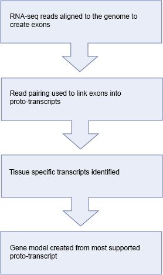

# Automatic annotation using RNA-seq data

* For each tissue or individual, the raw reads are aligned to the genome using [BWA](http://bio-bwa.sourceforge.net/). This step allows us to quickly identify regions of the genome that are actively transcribed. We use the results from all tissues to create one set of alignment blocks roughly corresponding to exons.

* Read pairing information is used to group exons into one set of approximate transcript structures called proto-transcripts.

* Next, both the pooled (merged) reads and also reads from each tissue that were partially mapped by BWA are re-aligned to the proto-transcripts using [Exonerate](http://bmcbioinformatics.biomedcentral.com/articles/10.1186/1471-2105-6-31) and a short word length to create a merged or tissue-specific set of spliced alignments representing canonical and non-canonical introns.

* Gene models are created by combining the proto-transcripts with the spliced reads to create all possible variants, the variant with the most read support is displayed.

## References

[Incorporating RNA-seq data into the zebrafish Ensembl genebuild](http://europepmc.org/abstract/MED/22798491)
John E. Collins, Simon White, Stephen M.J. Searle and Derek L. Stemple
Genome Research 2012
