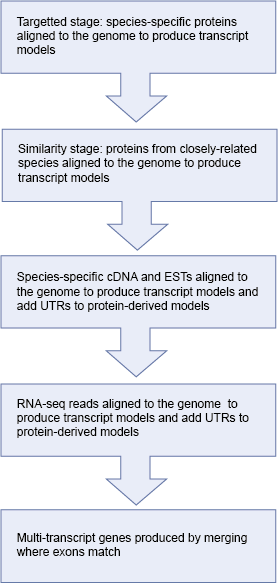

# Automatic annotation of coding genes

There are several steps in the annotation of coding genes onto [repeat-masked genomes](assembly_repeats.md). These steps are summarised in the following diagram and described in detail below:

* The first stage of the Ensembl annotation process is known as the **Targeted stage**. Here, species-specific proteins are aligned to the genome and Genewise and/or Exonerate is used to build a transcript structure for the protein on the genome.

* The Targeted stage is followed by the **Similarity stage** in which proteins from closely related species are used to build transcript structure in regions were a Targeted transcript structure is absent. For those species having a lot of experimentally-generated protein sequences, the Targeted stage tends to contribute most of the gene structures in the Ensembl annotation process. However, for species with fewer species-specific protein sequences the Similarity stage plays a much more important role in predicting gene structures.

* The next stage in the Ensembl annotation process is to align species-specific cDNA and EST sequences to the genome. Where cDNA alignments overlap transcripts predicted in the preceding stages, any non-translated region from the cDNA is spliced onto the transcript prediction as UTR. EST alignments are displayed on our website but are usually not used as supporting evidence in the Ensembl annotation process.

* Where available, we also align RNA-seq reads to the genome and build RNA-seq-based transcript models from these data. These models may also be used to add new genes or transcript isoforms into the gene set, and to add UTR to protein-coding models.

* The final set of transcript predictions is obtained by merging identical transcripts built from different proteins sequences to produce multi-transcript gene predictions, each with a non-redundant set of transcripts models. For every transcript model, the protein and mRNA sequences used to predict the model is viewable in the browser as 'supporting evidence'.

* Where transcripts have identical exons, these are combined to form a gene.

## Pseudogenes

Transcripts are scanned for pseudogene behaviour or false coding sequence. A transcript is considered a pseudogene if one of these four criteria are met:

1. It is a single exon transcript and it matches a multi-exon transcript elsewhere in the genome.
2. The transcript is completely masked out by repeat masker.
3. The transcript contains no introns and multiple frameshifts.
4. The transcript contains frameshifts and all of the introns are >80% covered by repeats.
