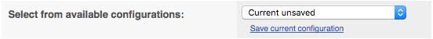

# Ensembl Accounts

Ensembl accounts allow you to save data and views in Ensembl. For example, you can save bookmarks, save configurations and sets, save your own data to Ensembl and share any of these with colleagues.

## How to set up an account

You can set up an account by clicking on _Login/Register_ at the top left of an Ensembl page, then select _Register_. You will then be prompted to enter your name, email, the organisation where you work or study and your country. You can choose whether you want to be added to Ensembl mailing lists.

Once you have registered, you can log into your account by clicking onto _Login/Register_. When you are logged in, this will display your email address. Click on it to access your account.

## Saving jobs

When you run a job through an [Ensembl tool](/info/docs/tools/index.html), such as the [Variant Effect Predictor](/Tools/VEP?db=core) or [BLAST](/Tools/Blast?db=core), you can save that job to your account. Just click on the floppy disk icon  in the jobs table. Your saved jobs will be stored in a list when you go to these tools - make sure you give them a memorable name so they're easy to spot later.

## Saving bookmarks

If you've found a page you're interested in, you can bookmark it to your Ensembl account. On the left hand side of a page, you should see a blue button saying _Bookmark this page_. This will give you options to add the page to your account.

Click on your email address in the top left to be given a list of your bookmarks.

## Save configurations and sets

Many Ensembl pages are configurable to display the datasets you're interested in. When you've configured a page a certain way, you might want to change it, but go back to that view later. An easy way to do this is save configurations.

At the top of the _Configure this page_ menu there is an option to save your configuration or to access saved configurations

Click on *Save current configuration* to save and name your configuration. To load a saved configuration, choose it from the list.

## Save custom data

If you upload your own data to Ensembl, you can save it to your account. Uploaded data will be automatically be added to your session. You can save it to your account by clicking on the blue _Custom Tracks_ button.

You will get to a list of your uploaded data. Save it by clicking on the floppy disk icon .

## Accounts and Sessions

You can log into your user account from any computer you go to. Your session is linked to the computer you are on and is accessible to anyone using that computer. You should save things to your user account if you would like to go back to them at a later date, if you use multiple computers or if you use a shared computer. Only save things to your session if you don't need to go back to them another day.

Configurations and custom data can all be saved to either your user account or your session. If you have something saved to your session and you'd like to save it to your user account, click on the floppy disk icon .

## Sharing data

Saved data can be shared to other users. You can do this by forming groups. Click on your email address at the top left then select _My Account_ from the drop-down. This will take you to a summary of your account. In the menu on the left there are options to create or join groups. For example, you could create a group for your lab or collaborators.

If you are an administrator for a group, you can share data with the group. You can share custom data, bookmarks and configurations. In each of their menus you will see the Share icon . Click on it to get the option of sharing with each of your different groups or sharing via URL, which you can put in an email.

You will see data that have been shared with your groups when you go into the different menus. They are listed under _*Data* from your groups_.
