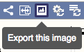
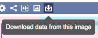

# Export Data

Data can be exported from Ensembl pages in various formats. Because we're open access, all the data and images you export are free to be used and reproduced in papers, posters, presentations and websites.

We respectfully request that you do not script against the export pages on the Ensembl website, as this degrades the service for other web visitors. We provide various large scale export options, including [BioMart], the [Perl APIs], the [REST API], the [MySQL server] and the [FTP site], depending on the volume and type of export you're carrying out.

## Exporting data files

You'll find the **Export data** button on the left-hand side of many pages in the Gene, Location and Transcript tabs. It allows you to export data related to the gene, location or transcript, not necessarily related to the page you're looking at.

From these links you can export sequence, features in BED, CSV, TSV, GTF, GFF and GFF3 formats, and [EMBL](http://www.ebi.ac.uk/ena/submit/sequence-format) or [GenBank](https://www.ncbi.nlm.nih.gov/Sitemap/samplerecord.html) flatfiles.

## Exporting sequence

Sequence pages include a link above the sequence for downloading the sequence. You can either download as FASTA, suitable for using with sequence analysis tools, or as rich text format (RTF), for visual analysis.

## Exporting images

Many images in Ensembl have an export icon at the top-left within the blue bar. This allows you to download images optimised for different purposes, in terms of size, resolution and colour saturation:

* PDF file - Standard image as PDF file.
* Presentation - Saturated image, better suited to projectors.
* Poster - Very high resolution, suitable for posters and other large print uses.
* Journal/report - High resolution, suitable for printing at A4/letter size.
* Web - Standard image, suitable for web pages, blog posts, etc.
* Custom image - Select from a range of formats and sizes.

You are welcome to reproduce these images in your own work.

## Exporting tables

The icon at the top right of many Ensembl tables allows you to download them as CSV, which you can open as a spreadsheet.

## Exporting comparative genomics data

The gene tree and homologue pages allow you to export the gene trees and alignments between the homologues in various formats.
