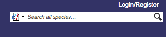
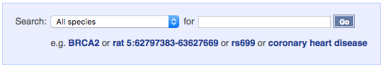

# Searching Ensembl

The search function in Ensembl allows you to find the genomic features you're interested in. You'll find the a search box on every page in Ensembl, in the blue bar at the top.

There's also an extra search box on the homepage, which includes an extra species selection facet.

<iframe title="Search video" width="480" height="390" src="https://www.youtube.com/watch?v=jcvF9HJeaZk&t=3s&ab_channel=EnsemblHelpdesk" frameborder="0" allowfullscreen></iframe>
