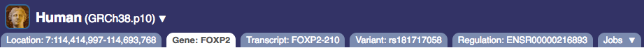
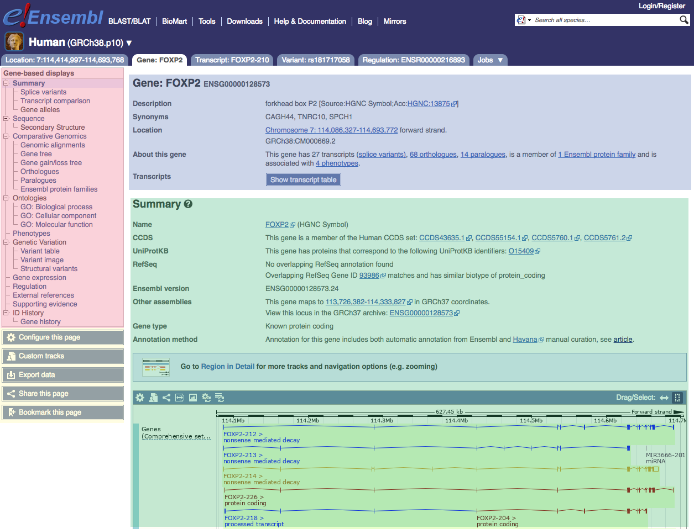

# Ensembl tabs

Different feature types are displayed as tabs in Ensembl. As you open different features, the tabs will appear at the bottom of the blue bar in Ensembl.

The available tabs are (click on the links to learn more about the pages available in each tab):

* [Location]
* [Gene]
* [Transcript]
* [Variant]
* [Phenotype]
* [Regulation]
* [Jobs]

Within each tab there is a standard layout:

**Top section [blue].** The top section contains general information on the data in the tab selected. For example, in the gene tab it contains the gene name and ID, the gene's location and a button to view a table of the transcripts. In the location tab it shows you a graphic of your location on the chromosome.

**Bottom section [green].** This section contains more specific information relating to the view. It is represented in either graphic or tabular format. For example, on the gene tab it contains the gene summary which displays the transcripts on the chromosome.  

**Displays [pink].** The displays on the left-hand side are specific to the tab you are on; you can access more information on the data of interest. For example, on the gene tab, from the links in the 'Gene-based displays' section you can access information such as: splice variants, the gene sequence, homologues and variation data.

**Configuring and managing your data [yellow].** The options in these boxes allow you to [configure the data](configure_this_page.md) (ie change the data types) displayed in the main sections (top and bottom) of the page, to manage your data (ie upload your own information) and [export it](export_data.md).
