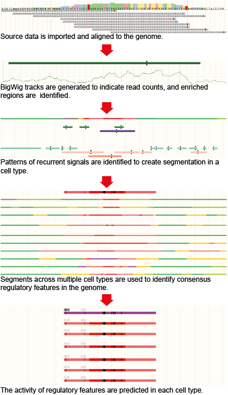

# The Ensembl Regulatory Build

The Ensembl Regulatory Build ([Zerbino et al. 2015](http://genomebiology.biomedcentral.com/articles/10.1186/s13059-015-0621-5)) contains a genome-wide set of regions that are likely to be involved in gene regulation. The classification of these regions are:

* Promoters
* Promoter flanking regions
* Enhancers
* CTCF binding sites
* Transcription factor binding sites
* Open chromatin regions

## Overview of the build

## Computational Steps

### Processing high-throughput sequencing datasets

Ensembl first imports [publicly available data](sources page) from different large epigenomic consortia (currently includes ENCODE, Roadmap Epigenomics and Blueprint). All high-throughput sequencing data sets are then uniformly processed using the [Ensembl Regulation Sequence Analysis (ERSA)](peak_calling.md) pipeline to generate signal tracks in bigWig format (available for download through our FTP site or for visualisation on the Ensembl genome browser) and enriched regions (also referred to as annotated features or peaks and are available through the Regulation Biomart, Perl API or MySQL db).

### Genome Segmentation

A [genome segmentation algorithm](regulatory_segmentation.md) is then applied across all epigenomic assays for those cell types for which a minimum set of assays is available. This minimum set includes six histone modification assays: H3K4me1, H3K4me3, H3K9ac or H3K9me3, H3K27ac, H3K27me3 and H3K36me3. The segmentation step first defines a fixed number of recurrent signal patterns across all datasets, called states, and then assigns one of these states to each bp across the genome for each cell type.

For each state of each segmentation, we create a summary track which represents the number of cell types that have that state at any given base pair of the genome. The overlaps of this summary function with known features (transcription start sites, exons) and experimental features (CTCF binding sites, known chromatin repression marks) are used to assign a preliminary label to that state. For practical purposes, this annotation is then manually curated. The labels used to functionally annotate the states are:
* CTCF
* Enhancer
* Heterochromatin
* Gene
* Predicted Weak enhancer/Cis-reg element
* Promoter flank
* TSS
* Poised
* Repressed

### Defining the Regulatory Build

We first determine a cell type independent functional annotation of the genome, referred to as the Regulatory Build, which summarises the function of genomic regions, known as [regulatory features](regulatory_features.md).

To determine whether a state is useful in practice, it is compared to the overall density of transcription factor binding, as these is measured by the TF ChIP-seq datasets included in the Ensembl Regulation resources. Applying increasing integer cutoffs to this signal, we define progressively smaller regions. If these regions reach a 2-fold enrichment in transcription factor binding signal, then the state is retained for the build. This means that although all states are annotated, not all are used to build the Regulatory Build.

For any given segmentation, we define initial regions. For every functional label, all the state summaries that were assigned that labelled and judged informative are summed into a single function. Using the overall TF binding signal as true signal, we select the threshold which produces the highest F-score.

We then merge the regulatory features across segmentations by annotation.

Some simplifications are applied *a posteriori*:

* Distal enhancers which overlap promoter flanking regions are merged into the latter.
* Promoter flanking regions which overlap transcription start sites are incorporated into the flanking regions of the latter features.

#### Extra features

In addition to the segmentation states, which are essentially derived from histone marks, we integrate independent experimental evidence:

* Transcription factor binding sites, which were observed through ChIP-seq, but are covered by none of the newly defined features are added to the Regulatory Build.
* Open chromatin regions, which were experimentally observed through DNase-seq, but covered by none of the above annotations, are also added to the Regulatory Build.

### Cell type specific activity levels

For each cell type the regulatory features are assigned labels to describe their activity levels. For each cell type and each regulatory feature defined in the Regulatory Build, we check whether there is a segmentation state or experimental evidence (TF binding from ChIP-seq data or open chromatin from DNase-seq data) that could be used to test the activity of this annotation. Based on this then the activity levels can be one of the following:

* ACTIVE, when the feature displays an active epigenetic signature.
* POISED, when the feature displays a epigenetic signature with the potential to be activated.
* REPRESSED, when the feature is epigenetically repressed.
* INACTIVE, when the region bears no epigenetic modifications from the ones included in the Regulatory Build.
* NA, when there is no available data in the cell type for this feature.

## Transcription factor binding motif annotation

For each transcription factor (TF), for which a ChIP-seq data set is part of the Ensembl Regulation resources and a position weight matrix (PWM) is available, we annotate the position of putative TF binding sites within the ChIP-seq peaks.

PWMs are taken from [JASPAR](http://jaspar.genereg.net/) ([Bryen *et al.*, 2008](http://europepmc.org/articles/PMC2238834)) and mapped to the genome using the find_pssm_dna program from the [MOODS](https://www.cs.helsinki.fi/group/pssmfind/) software ([Korhonen *et al.*, 2009](http://europepmc.org/articles/PMC2778336)) with the -f flag set and a permissive threshold of 0.001. We then filter these mappings using a log odds score threshold. The threshold is derived per PWM by considering the occurrence of mappings in a sample of randomly positioned 'background' sequences, matched in terms of size and chromosome to the ChIP-seq peaks for a given TF. We select the threshold such that the proportion of these background peaks containing a mapping is approximately 5%. Only mappings that overlap the corresponding ChIP-seq peaks are included in the functional genomics database.

PWM features, also known as MotifFeatures, are visualised in the browser as black boxes within regulatory features and TF evidence peaks. Sometimes these boxes are very thin and appear as lines. Clicking on the black box will highlight specific information in the pop-up menu, such as the matching score, which is relative to the optimal site.
